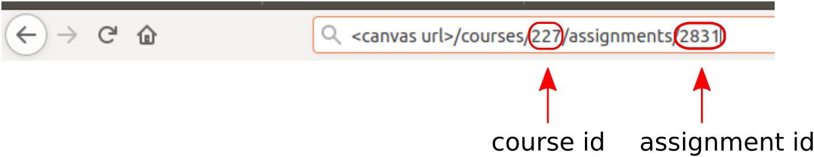

# Canvas client
A python client for grading canvas submissions.

## Install

1. Make sure you have installed `pip` and `python3`

2. Install the client: `pip install canvas_client`

## Setup

1. Create and open a folder where you want to download the submissions

2. Create a `config.json` file by running `canvas_client` in terminal (the config will be saved in the current folder)

3. Fill the config properly (see the notes below):
    
    - e.g:
        
            {
                "url": "canvas.university.edu",
                "access_token": "1234abcdef",
                "course_id": 157,
                "labs": {
                    "L1": {
                        "assignment_id": 1024
                    },
                    "L2": {
                        "assignment_id": 1025
                    }
                }
            }
            
            
        **Note$^1$**: you can find the `course id` and `assingment id` by opening the approriate assingment in canvas: 
        

        **Note$^2$**: to get an *access token*: open canvas, go to `Your profile` -> `Settings` -> `New access token` -> `Generate Token` -> copy the value

    

## Usage
1. Download the submissions:

    `canvas_client <assingment name> -d`
    
    e.g.:
    
    `canvas_client L1 -d`

    This command downloads the submissions into the `assigments` folder and creates an `L1.xls` file with the student names, comments, etc. Write the grades and comments into this file.

2. To upload the grades and comments:
    
    `canvas_client <assingment_name> -u`
    e.g.:
    `canvas_client L1 -u`

    This command uploads the content of the `L1.xls`

    **Note**: the grades will appear on canvas after 10-15 seconds (refresh the page if necessary)